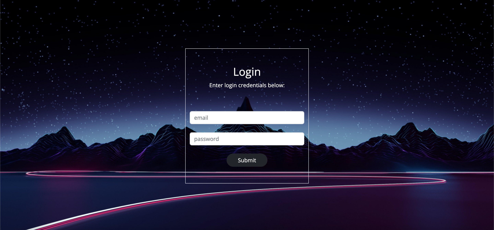
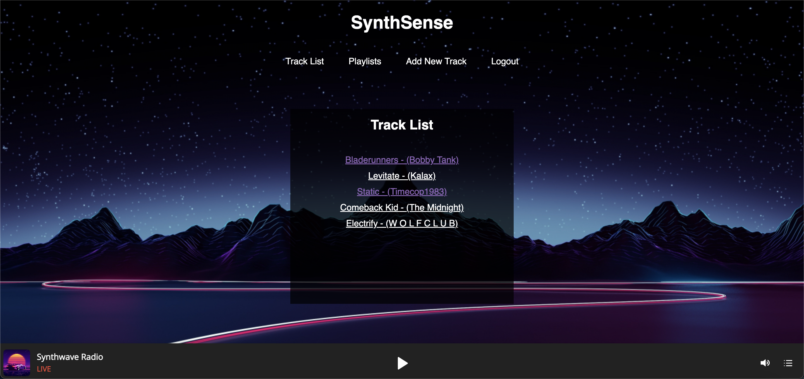
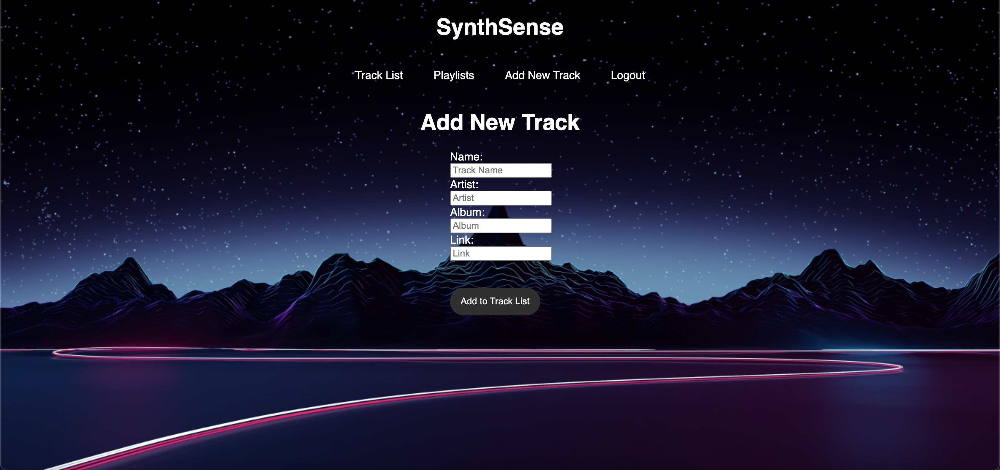
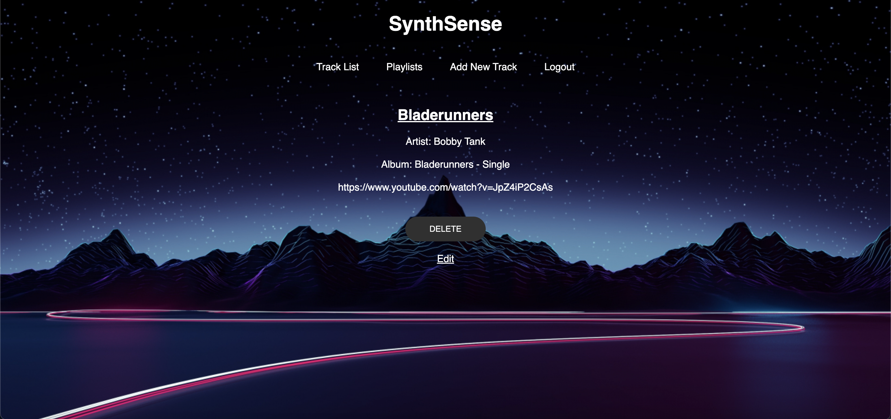

# SynthSense

## A synthwave-themed journal for logging your favorite synthwave songs

## Technologies Used
* HTML5
* CSS3
* Javascript
* EJS
* Node.js
* Express
* Mongoose
* MongoDB
* Bootstrap

## Screenshots

## Getting Started
https://synth-sense.herokuapp.com/

## Future Enhancements
* Add feature that enables users to play music within the browser.
* Add feature where users can add songs to a playlist.
* Add API functionality to pull song/artist data.
